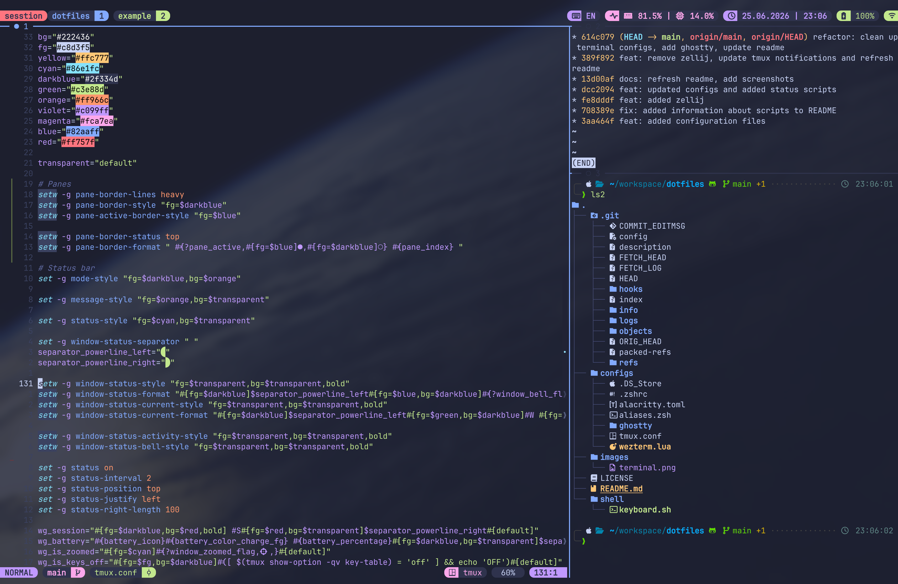

# Dotfiles

This repository contains configuration files (dotfiles) for setting up a development environment across macOS, Linux, and Windows (via WSL/Git Bash).

## Configuration Files

### Terminal & Shell
- **`.zshrc`** — Main Zsh configuration with Oh My Zsh, Powerlevel10k, plugins, and environment settings
- **`aliases.zsh`** — Custom aliases and functions for shell productivity
- **`alacritty.toml`** — Alacritty terminal emulator configuration
- **`wezterm.lua`** — WezTerm terminal emulator configuration
- **`ghostty/config`** — Ghostty terminal emulator configuration

### Terminal Multiplexers
- **`tmux.conf`** — Tmux configuration with custom keybindings, powerline-style status bar, popups, synchronize-panes, scratchpad, and plugins

### Shell Scripts
- **`shell/keyboard.sh`** — macOS input source indicator used by the Tmux status bar (shows `RU`/`EN`/etc.)

## Screenshots

### Terminal


## Color Schemes

The configurations are tuned for dark themes:

- **Tokyo Night Moon** — primary color scheme for Tmux and Ghostty
- **Catppuccin Mocha** — alternative Tmux palette (commented out, easy to switch)
- **Dracula / Catppuccin Mocha** — available in WezTerm theme toggle

To switch Tmux between Tokyo Night Moon and Catppuccin Mocha, comment/uncomment the corresponding block in `configs/tmux.conf` under the `# Theme` section.

## Installation Paths

Files should be placed in the following locations:

```
~/.zshrc
~/.config/alacritty/alacritty.toml
~/.config/ghostty/config
~/.wezterm.lua
~/.tmux.conf
~/.tmux/keyboard.sh
~/.oh-my-zsh/aliases/aliases.zsh
```

## Installation

1. Clone the repository:
   ```bash
   git clone https://github.com/Pepetka/dotfiles.git ~/dotfiles
   ```

2. Create necessary directories:
   ```bash
   mkdir -p ~/.config/alacritty
   mkdir -p ~/.config/ghostty
   mkdir -p ~/.oh-my-zsh/aliases
   mkdir -p ~/.tmux
   ```

3. Create symbolic links:
   ```bash
   # Zsh configuration
   ln -sf ~/dotfiles/configs/.zshrc ~/.zshrc
   ln -sf ~/dotfiles/configs/aliases.zsh ~/.oh-my-zsh/aliases/aliases.zsh

   # Terminal emulators
   ln -sf ~/dotfiles/configs/alacritty.toml ~/.config/alacritty/alacritty.toml
   ln -sf ~/dotfiles/configs/ghostty/config ~/.config/ghostty/config
   ln -sf ~/dotfiles/configs/wezterm.lua ~/.wezterm.lua

   # Tmux
   ln -sf ~/dotfiles/configs/tmux.conf ~/.tmux.conf
   ln -sf ~/dotfiles/shell/keyboard.sh ~/.tmux/keyboard.sh
   ```

4. Install Tmux plugins:
   - Install [Tmux Plugin Manager (TPM)](https://github.com/tmux-plugins/tpm)
   - Open Tmux and press `prefix + I` to install plugins

## Prerequisites

### Required
- **[Oh My Zsh](https://ohmyz.sh/)** — Framework for Zsh configuration
- **[Powerlevel10k](https://github.com/romkatv/powerlevel10k)** — Zsh theme (referenced in `.zshrc`)
  - `~/.p10k.zsh` is user-specific and generated by `p10k configure`

### Optional Terminal Emulators
- **[Alacritty](https://alacritty.org/)** — Fast, cross-platform terminal emulator
- **[WezTerm](https://wezfurlong.org/wezterm/)** — GPU-accelerated terminal emulator
- **[Ghostty](https://ghostty.org/)** — Fast, native, feature-rich terminal emulator

### Optional Terminal Multiplexers
- **[Tmux](https://github.com/tmux/tmux)** — Terminal multiplexer
- **[Tmux Plugin Manager](https://github.com/tmux-plugins/tpm)** — Plugin manager for Tmux

### Zsh Plugins (installed via Oh My Zsh)
The `.zshrc` includes several plugins that enhance the shell experience:
- `zsh-autosuggestions` — Command suggestions
- `zsh-syntax-highlighting` — Syntax highlighting
- `fzf` — Fuzzy finder integration
- `git` — Git aliases and functions
- `nvm` — Node Version Manager integration
- `npm`, `bun`, `docker`, `direnv`, `extract`, `sudo`, and more (see `.zshrc` for full list)

## Features

### Tmux
- **Prefix** changed to `Ctrl + a`
- **Vi-style copy mode** with system clipboard integration
- **Mouse support** for selection, resizing, and scrolling
- **Popups**:
  - `prefix + f` — floating scratchpad session
  - `prefix + Ctrl + f` — fzf session switcher
  - `prefix + ?` — keybindings cheatsheet
- **Synchronize panes** toggle with `prefix + e` and visual `SYNC` indicator
- **Window management**:
  - `prefix + Shift + h/l` — swap window left/right
  - `prefix + x/X/Q` — kill pane/window/session
- **Powerline-style status bar** with session, layout, CPU/RAM, battery, and time widgets
- **Tokyo Night Moon** color scheme (Catppuccin Mocha available as alternative)

### Aliases & Functions
The configuration includes numerous aliases for:
- Git operations (`gs`, `ga`, `gc`, `gcom`, etc.)
- Navigation (`ls` with `eza`, directory shortcuts)
- Development tools (npm, docker, etc.)
- AI coding agent providers (`deepseek`, `zai`, `minimax`, `kimic`)

### Custom Functions
- `yy()` — Yazi file manager integration
- `gcom()` — Smart git checkout `master`/`main`
- `hurl_pretty()` — Pretty-printed HTTP responses
- `ts3()` — Tmux three-pane development layout

## License

This repository is distributed under the MIT License. See the [LICENSE](LICENSE) file for details.
