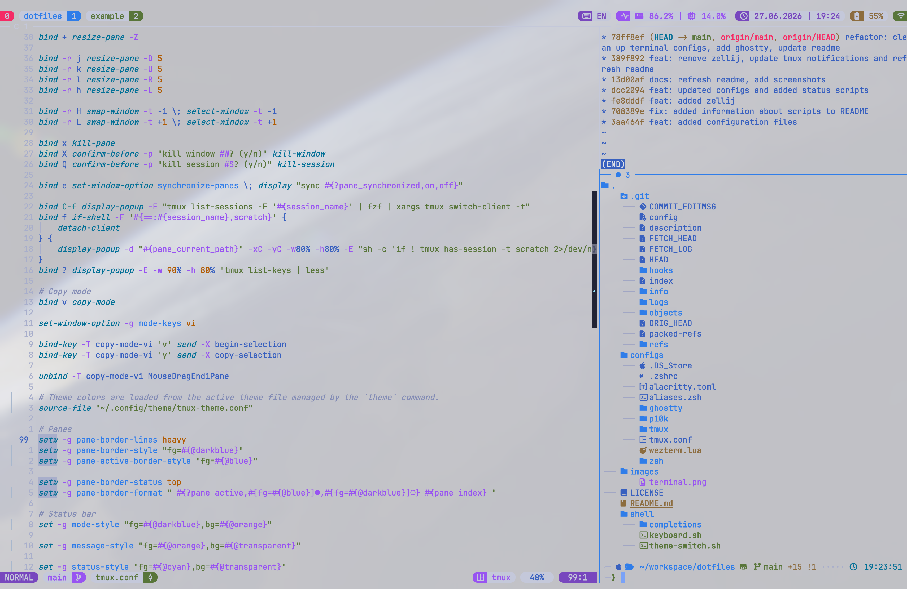

# Dotfiles

This repository contains configuration files (dotfiles) for setting up a development environment across macOS, Linux, and Windows (via WSL/Git Bash).

## Configuration Files

### Terminal & Shell
- **`.zshrc`** — Main Zsh configuration with Oh My Zsh, Powerlevel10k, plugins, and environment settings
- **`aliases.zsh`** — Custom aliases, functions, and the `theme` command
- **`zsh/secrets.zsh.example`** — Example file for private API keys and secrets; copy to `~/.config/zsh/secrets.zsh`
- **`alacritty.toml`** — Alacritty terminal emulator configuration
- **`alacritty/themes/tokyonight-*.toml`** — Alacritty dark/light theme files
- **`wezterm.lua`** — WezTerm terminal emulator configuration
- **`ghostty/config`** — Ghostty terminal emulator configuration
- **`ghostty/theme-*.conf`** — Ghostty dark/light theme files

### Terminal Multiplexers
- **`tmux.conf`** — Tmux configuration with custom keybindings, powerline-style status bar, popups, synchronize-panes, scratchpad, and plugins
- **`tmux/tokyonight-*.conf`** — Tmux dark/light theme files using tmux user options (`@bg`, `@fg`, ...)

### Shell Prompt
- **`p10k/p10k-dark.zsh`** — Powerlevel10k configuration for TokyoNight Moon
- **`p10k/p10k-light.zsh`** — Powerlevel10k configuration for TokyoNight Day

### Shell Scripts
- **`shell/theme-switch.sh`** — Unified theme switcher for tmux, Ghostty, Alacritty, WezTerm, Neovim, and Powerlevel10k
- **`shell/keyboard.sh`** — macOS input source indicator used by the Tmux status bar (shows `RU`/`EN`/etc.)

## Screenshots

### Terminal — TokyoNight Moon (dark)


### Terminal — TokyoNight Day (light)


## Unified Theme Switching

The `theme` command switches the active theme for tmux, Ghostty, Alacritty, WezTerm, Neovim, and the current pane's Powerlevel10k prompt:

```bash
theme dark    # TokyoNight Moon
theme light   # TokyoNight Day
theme toggle  # switch between dark and light
theme status  # show current mode
```

`theme` is a shell function defined in `configs/aliases.zsh`. Zsh completions for it are provided in `shell/completions/` and added to `fpath` in `.zshrc`.

### How it works

- The source of truth is `~/.config/theme/mode` (`dark` or `light`; dark is the default).
- `~/.config/theme/ghostty-theme.conf` is a symlink to the active Ghostty theme file.
- `~/.config/theme/alacritty-theme.toml` is a symlink to the active Alacritty theme file.
- `~/.config/theme/tmux-theme.conf` is a regular file overwritten by the selected Tmux theme. Tmux uses user options (`@bg`, `@fg`, ...) and format references (`#{@bg}`), so color changes apply instantly with a single `source-file`.
- WezTerm reads `~/.config/theme/mode` and applies the matching built-in color scheme (`tokyonight_moon` or `tokyonight_day`). `~/.wezterm.lua` is touched after a theme change to trigger WezTerm's auto-reload.
- `~/.p10k.zsh` is a symlink to either `configs/p10k/p10k-dark.zsh` or `configs/p10k/p10k-light.zsh`.
- Neovim watches `~/.config/theme/mode` and switches between `tokyonight-moon` and `tokyonight-day`. Lualine is rebuilt on every `ColorScheme` event using dynamic colors from `utils/colors.lua`.

### Powerlevel10k update behavior

- The **active pane** updates immediately when you run `theme` (the prompt is redrawn after `p10k reload`).
- **Other tmux panes** pick up the new p10k theme the next time they run a command (via a `precmd` hook that checks whether `~/.p10k.zsh` changed).

## Color Schemes

- **TokyoNight Moon** — primary dark color scheme for tmux, Ghostty, Alacritty, WezTerm, Neovim, and p10k
- **TokyoNight Day** — primary light color scheme for tmux, Ghostty, Alacritty, WezTerm, Neovim, and p10k

## Installation Paths

Files should be placed/symlinked in the following locations:

```
~/.zshrc
~/.p10k.zsh
~/.config/alacritty/alacritty.toml
~/.config/ghostty/config
~/.config/theme/
~/.config/zsh/secrets.zsh
~/.wezterm.lua
~/.tmux.conf
~/.tmux/keyboard.sh
```

## Installation

1. Clone the repository:
   ```bash
   git clone https://github.com/Pepetka/dotfiles.git ~/workspace/dotfiles
   ```

2. Create necessary directories:
   ```bash
   mkdir -p ~/.config/alacritty
   mkdir -p ~/.config/ghostty
   mkdir -p ~/.config/theme
   mkdir -p ~/.config/zsh
   mkdir -p ~/.tmux
   ```

3. Create symbolic links:
   ```bash
   # Zsh configuration
   ln -sf ~/workspace/dotfiles/configs/.zshrc ~/.zshrc

   # Terminal emulators
   ln -sf ~/workspace/dotfiles/configs/alacritty.toml ~/.config/alacritty/alacritty.toml
   ln -sf ~/workspace/dotfiles/configs/ghostty/config ~/.config/ghostty/config
   ln -sf ~/workspace/dotfiles/configs/wezterm.lua ~/.wezterm.lua

   # Tmux
   ln -sf ~/workspace/dotfiles/configs/tmux.conf ~/.tmux.conf
   ln -sf ~/workspace/dotfiles/shell/keyboard.sh ~/.tmux/keyboard.sh
   ```

   Aliases are sourced directly from `$DOTFILES/configs/aliases.zsh` in `.zshrc`, so no separate symlink is needed.

4. The `theme` command will create `~/.config/theme/` contents and manage the `~/.p10k.zsh` symlink on first run.

5. Install Tmux plugins:
   - Install [Tmux Plugin Manager (TPM)](https://github.com/tmux-plugins/tpm)
   - Open Tmux and press `prefix + I` to install plugins

## Prerequisites

### Required
- **[Oh My Zsh](https://ohmyz.sh/)** — Framework for Zsh configuration
- **[Powerlevel10k](https://github.com/romkatv/powerlevel10k)** — Zsh theme
  - `~/.p10k.zsh` is a symlink managed by the `theme` command; do not run `p10k configure` unless you want to overwrite it

### Optional Terminal Emulators
- **[Alacritty](https://alacritty.org/)** — Fast, cross-platform terminal emulator
- **[WezTerm](https://wezfurlong.org/wezterm/)** — GPU-accelerated terminal emulator
- **[Ghostty](https://ghostty.org/)** — Fast, native, feature-rich terminal emulator

### Optional Terminal Multiplexers
- **[Tmux](https://github.com/tmux/tmux)** — Terminal multiplexer
- **[Tmux Plugin Manager](https://github.com/tmux-plugins/tpm)** — Plugin manager for Tmux

### Zsh Plugins (installed via Oh My Zsh)
The `.zshrc` includes several plugins that enhance the shell experience:
- `zsh-autosuggestions` — Command suggestions
- `zsh-syntax-highlighting` — Syntax highlighting
- `fzf` — Fuzzy finder integration
- `git` — Git aliases and functions
- `nvm` — Node Version Manager integration
- `npm`, `bun`, `docker`, `direnv`, `extract`, `sudo`, and more (see `.zshrc` for full list)

## Features

### Tmux
- **Prefix** changed to `Ctrl + a`
- **Vi-style copy mode** with system clipboard integration
- **Mouse support** for selection, resizing, and scrolling
- **Popups**:
  - `prefix + f` — floating scratchpad session
  - `prefix + Ctrl + f` — fzf session switcher
  - `prefix + ?` — keybindings cheatsheet
- **Synchronize panes** toggle with `prefix + e` and visual `SYNC` indicator
- **Window management**:
  - `prefix + Shift + h/l` — swap window left/right
  - `prefix + x/X/Q` — kill pane/window/session
- **Powerline-style status bar** with session, layout, CPU/RAM, battery, and time widgets
- **TokyoNight Moon** color scheme

### Aliases & Functions
The configuration includes numerous aliases for:
- Git operations (`gs`, `ga`, `gc`, `gcom`, etc.)
- Navigation (`ls` with `eza`, directory shortcuts)
- Development tools (npm, docker, etc.)
- AI coding agent providers (`deepseek`, `zai`, `minimax`, `kimic`)

### Custom Functions
- `theme` — Switch the active terminal/editor theme
- `yy()` — Yazi file manager integration
- `gcom()` — Smart git checkout `master`/`main`
- `hurl_pretty()` — Pretty-printed HTTP responses
- `ts3()` — Tmux three-pane development layout

## License

This repository is distributed under the MIT License. See the [LICENSE](LICENSE) file for details.
